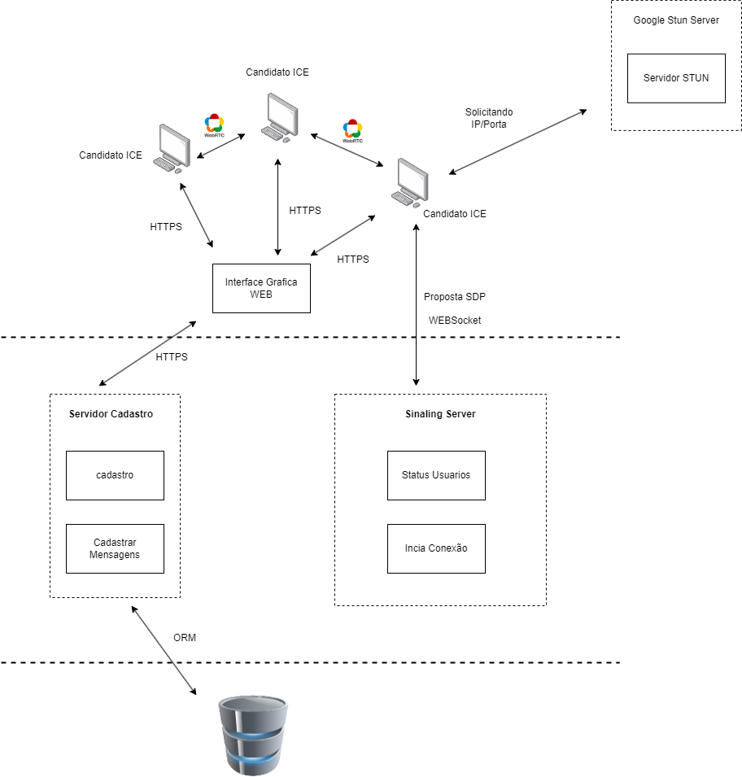

# RandomZAP
O RandomZAP é um projeto de sistemas distribuidos que conecta dois clientes desconhecidos de forma aleatória, em um chat.

## Características de Sistemas Distribuidos
- Pear to Pear (P2P)
- Cliente-Servidor

## Tecnologias 
- FrontEnd: React
- BackEnd: Node
- WebRTC
- Banco de Dados: MySQL

## Funcionalidades
### Fluxo Principal
- O cliente podera realizar a criação de uma conta
    * Cadastrar username
    * Cadastrar Email
    * Foto de Perfil
- O cliente podera se logar
- Entrar em uma fila de conversa
- Mandar mensagens de texto no chat

### Fluxo Alternativo
- Cliente pode cancelar uma espera na fila
- Cliente pode sair de uma conversa
- Cliente pode deslogar

### Fluxo Idealizado
- Cliente podera mandar imagens

- Cliente podera conversar com **N** pessoas aleatorias

### Funcionamento
1 - O clientes são reconhecidos como candidatos a uma potencial conexão, porém por regras de firewall e NAT a conexão entre dois browser é dificultada.

2 - Para isso é usado um STUN server, que no caso é um servidor publico google que quando requisitado pela biblioteca Peer.js retorna informações necessarias para que ocorra a conexão entre dois Hosts

3 - O Host então solicita seus dados ao servidor e guarda a resposta do servidor STUN, após isso ele envia os dados obtidos ao Sinaling-Server, que vai administrar que as informações sejam trocadas entre os usuarios

4 - É encaminhado ao Sinaling-Server uma conexão SDP que contem os dados necessarios para realizar a conexão, nela podem ser vinculados dados como permições de audio, video etc, porém no caso do Chat usaremos apenas uma coneção de para troca de dados simples

### Arquitetura

## Equipe
- Catarine Cruz
- Guilherme Matos 
